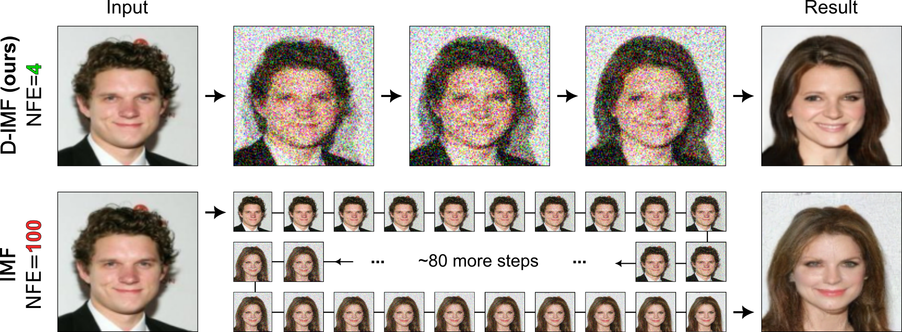
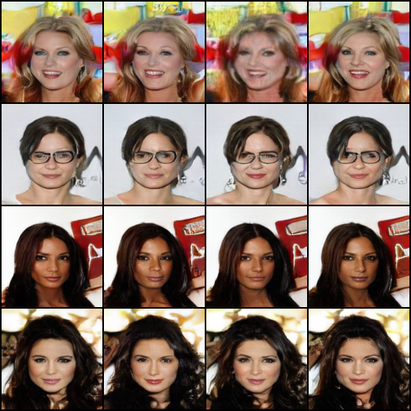
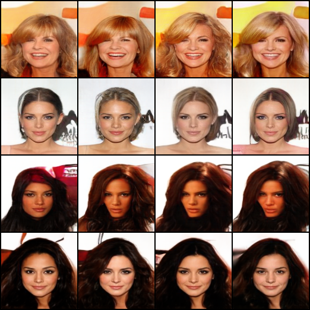

# PyTorch implementation of "Adversarial Schrödinger Bridge Matching"

This is the official Python implementation of the NeurIPS 2024 paper "Adversarial Schrödinger Bridge Matching" (poster at NeurIPS will be available [here](https://openreview.net/forum?id=L3Knnigicu)) by [Nikita Gushchin](https://scholar.google.com/citations?user=UaRTbNoAAAAJ), [Daniil Selikhanovych](https://scholar.google.com/citations?user=N9bInaYAAAAJ), [Sergei Kholkin](https://scholar.google.com/citations?user=KwhztSMAAAAJ), [Evgeny Burnaev](https://scholar.google.com/citations?user=pCRdcOwAAAAJ), [Alexander Korotin](https://scholar.google.com/citations?user=1rIIvjAAAAAJ).

The repository contains reproducible PyTorch source code for computing Schrödinger Bridge in high dimensions with adversarial neural networks. Examples are provided for toy problems (2D) and for the unpaired image-to-image translation task for various pairs of datasets. 

<p align="center"></p>

## Requirements ##
Create the Anaconda environment with the following command:
```
conda env create -f environment.yml
```
Then install the package ```eot_benchmark``` following the [repo](https://github.com/ngushchin/EntropicOTBenchmark).

## Download Celeba ##
Download Celeba dataset using the [link](https://drive.google.com/uc?export=download&id=0B7EVK8r0v71pZjFTYXZWM3FlRnM), unzip it and set the variable $data_root in training and testing scripts for Celeba accordingly. 

## Celeba-128, one-sided pretraining ##
To pretrain ASBM for male-to-female translation before running D-IMF procedure with $\epsilon=1$ and $T=4$ run the following commands:
```
cd experiment_scripts/celeba
bash train_celeba_128_male2female_ema_T_4_minibatch_ot_eps_1.sh
```
and with $\epsilon=10$:
```
cd experiment_scripts/celeba
bash train_celeba_128_male2female_ema_T_4_minibatch_ot_eps_10.sh
```
To pretrain ASBM for female-to-male translation before running D-IMF procedure with $\epsilon=1$ and $T=4$ run the following commands:
```
cd experiment_scripts/celeba
bash train_celeba_128_female2male_ema_T_4_minibatch_ot_eps_1.sh
```
and with $\epsilon=10$:
```
cd experiment_scripts/celeba
bash train_celeba_128_female2male_ema_T_4_minibatch_ot_eps_10.sh
```

## Celeba-128, D-IMF ##
To run D-IMF procedure for Celeba-128 with $\epsilon=1$ and $T=4$ after one-sided pretraining run the following commands:
```
cd experiment_scripts/celeba
bash train_celeba_128_T_4_imf_ema_sampling_eps_1.sh
```
and with $\epsilon=10$:
```
cd experiment_scripts/celeba
bash train_celeba_128_T_4_imf_ema_sampling_eps_1.sh
```
| Input | $T = 4, \epsilon = 10$ | $T = 4, \epsilon = 10$ |
|:---:|:---:|:---:|
|  |  |  |

## Celeba-128, pretrained checkpoint
To download pretrained D-IMF checkpoints for $\epsilon=1$ use the following [link](https://disk.yandex.ru/d/64cqt4kTurlJhw). 

## SwissRoll, 2D, one-sided pretraining ##
To pretrain ASBM for 2D Gaussian-to-SwissRoll translation before running D-IMF procedure with $\epsilon=0.03$ and $T=4$ run the following commands:
```
cd experiment_scripts/swissroll
bash train_gaussian2swissroll_T_4_eps_0.03.sh,
```
with $\epsilon=0.1$:
```
cd experiment_scripts/swissroll
bash train_gaussian2swissroll_T_4_eps_0.1.sh
```
and with $\epsilon=0.3$:
```
cd experiment_scripts/swissroll
bash train_gaussian2swissroll_T_4_eps_0.3.sh
```
To pretrain ASBM for SwissRoll-to-2D Gaussian translation before running D-IMF procedure with $\epsilon=0.03$ and $T=4$ run the following commands:
```
cd experiment_scripts/swissroll
bash train_swissroll2gaussian_T_4_eps_0.03.sh,
```
with $\epsilon=0.1$:
```
cd experiment_scripts/swissroll
bash train_swissroll2gaussian_T_4_eps_0.1.sh
```
and with $\epsilon=0.3$:
```
cd experiment_scripts/swissroll
bash train_swissroll2gaussian_T_4_eps_0.3.sh
```

## SwissRoll, 2D, D-IMF ##
To run D-IMF procedure for Gaussian-SwissRoll experiment with $\epsilon=0.03$ and $T=4$ after one-sided pretraining run the following commands:
```
cd experiment_scripts/swissroll
bash train_celeba_128_T_4_imf_ema_sampling_eps_1.sh
```
and with $\epsilon=10$:
```
cd experiment_scripts/swissroll
bash train_celeba_128_T_4_imf_ema_sampling_eps_1.sh
```
To visualize the results for D-IMF for $\epsilon=0.1$ run the following script:
```
cd experiment_scripts/swissroll
bash test_swiss_roll_imf_eps_0.1.sh
```

## Gaussian-to-Gaussian Schrödinger Bridge, D-IMF ##
To reproduce results from the paper for Gaussian-to-Gaussian Schrödinger Bridge follow the notebook ```D-IMF_Gaussian_case.ipynb```.

## Colored MNIST, D-IMF ##
To reproduce results from the paper for Colored MNIST experiment with $\epsilon=1$ run the following commands:
```
cd experiment_scripts/colored_mnist
bash ASBM_colored_mnist_eps_1.sh
```
and with $\epsilon=10$:
```
cd experiment_scripts/colored_mnist
bash ASBM_colored_mnist_eps_10.sh
```

## Entropy OT benchmark, D-IMF ##
To reproduce results from the paper for Entropy OT benchmark choose the values for dimension and epsilon (`current_dim` and `current_eps`) according to the text and run the following commands:
```
python train_SB_bench_ABM.py --D_opt_steps 3 --plan 'ind' --dim ${current_dim} --epsilon ${current_eps} --fb 'f' --num_timesteps 32 --num_iterations 100000 --eval_freq 2500
python train_SB_bench_ABM.py --D_opt_steps 3 --plan 'ind' --dim ${current_dim} --epsilon ${current_eps} --fb 'b' --num_timesteps 32 --num_iterations 100000 --eval_freq 2500
```
Then for D-IMF specify pretrain checkoint paths and run:
```
current_T=32
d_opt_steps=3

bw_ckpt='path_to_bw_first_D_IMF_iter_ckpt'
fw_ckpt='path_to_fw_first_D_IMF_iter_ckpt'

inner_imf_mark_proj_iters=50000

python train_ASBM_SB_bench.py --epsilon ${current_eps} --dim ${current_dim} --fw_ckpt ${fw_ckpt} --bw_ckpt ${bw_ckpt} --inner_imf_mark_proj_iters ${inner_imf_mark_proj_iters} --imf_iters 10 --eval_freq 5000 --num_timesteps ${current_T} --D_opt_steps ${d_opt_steps}
```

## Acknowledgement
This project is based on [DDGAN](https://github.com/NVlabs/denoising-diffusion-gan) work. We thank the authors for their awesome work.

## Citation

```
@inproceedings{
gushchin2024adversarial,
title={Adversarial Schr\"odinger Bridge Matching},
author={Gushchin, Nikita and Selikhanovych, Daniil and Kholkin, Sergei and Burnaev, Evgeny and Korotin, Alexander},
booktitle={The Thirty-eighth Annual Conference on Neural Information Processing Systems},
year={2024},
url={https://openreview.net/forum?id=L3Knnigicu}
}
```